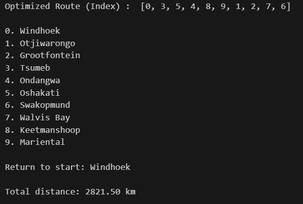

# Travelling Salesperson Problem (TSP) (Namibia) Using Simulated Annealing

This project solves the classic **Travelling Salesperson Problem (TSP)** for 10 major towns in Namibia using the **Simulated Annealing** algorithm. The objective is to find the shortest possible route that allows the salesperson to visit each town exactly once and to return to the starting point (Windhoek)— While also minimizing the total travel distance.

## Problem Context

The entity wants to visit 10 towns across Namibia efficiently. The towns are:

- Windhoek
- Swakopmund
- Walvis Bay
- Otjiwarongo
- Tsumeb
- Grootfontein
- Mariental
- Keetmanshoop
- Ondangwa
- Oshakati

This program uses a distance matrix with approximate road distances (in km) between all pairs of towns.

## Description

The algorithm applied here is **Simulated Annealing**, a local search algorithm that:

- Starts from a random valid route.
- Iteratively explores neighbouring solutions by swapping towns.
- Occasionally accepts worse solutions to escape local minima.
- Gradually reduces the probability of accepting worse solutions (cooling).
- Returns the best route found after a defined number of iterations.

In this project, we used a python-tsp library: a Python package designed to solve the Travelling Salesperson Problem (TSP) using different algorithms, including Simulated Annealing, Local Search, and Dynamic Programming.

It provides a very clean and simple interface for solving TSP using just a distance matrix.

We also used the import:

...from python_tsp.heuristics import solve_tsp_simulated_annealing...

This function:

Accepts a NumPy 2D array as a distance matrix

Applies the Simulated Annealing algorithm internally

Returns a tuple:

A route (list of indices) representing the best town visiting order and The total distance of that route

#### Why It’s Useful

Saves time: No need to implement the algorithm from scratch

Customizable: You can tune the parameters like temperature, decay, and iteration count if required

Efficient: It performs well for medium-sized TSPs (like in this case)

Readable: Keeps the code minimal and focused

#### How to Install

pip install python-tsp

## Usage

Running the program is very simple

### Step 1:

Assuming you have already cloned the repository, you have to ake sure you have the proper dependencies, that is Python 3

### Step 2:
If using vs code, just hit the run button. Otherwise ensure that you have all requirements for what ever IDE you are using in order to run the program.

## Sample Output

This is the output you should expect to see after running the code.

# Evaluation

The solution is not guaranteed to be optimal but is close to it. Good Enough!